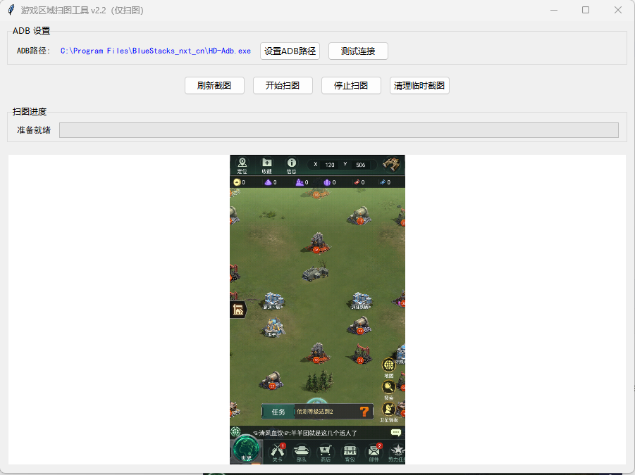

# GameMapScanner

基于 **Python、ADB、OpenCV 和 Tkinter** 开发的 Android 模拟器地图自动扫描工具。

通过 ADB 与 Android 模拟器通信，实现地图自动滑动、屏幕截图、区域遍历和扫描结果保存，并提供图形化操作界面。

## ✨ 主要功能

- 通过 ADB 与 Android 模拟器通信
- 自动获取模拟器实时截图
- 自动执行横向、纵向地图滑动
- 使用蛇形扫描路径遍历大型游戏地图
- 根据扫描行、列和移动方向自动命名截图
- 自动检测常见 Android 模拟器及 Android SDK 的 ADB
- 支持手动选择 ADB 可执行文件
- 使用 Tkinter 提供图形化操作界面
- 扫描任务使用独立线程运行，避免阻塞 GUI
- 自动管理和清理临时截图

## 🛠️ 技术栈

- **Python**
- **OpenCV**
- **NumPy**
- **Pillow**
- **Tkinter**
- **Android Debug Bridge (ADB)**

## 🔍 工作原理

程序通过 ADB 控制 Android 模拟器进行地图拖动，并在移动过程中自动获取屏幕截图。

为了减少重复移动，扫描过程采用往返式路径：

```text
Row 1  → → → → → →
                   ↓
Row 2  ← ← ← ← ← ←
↓
Row 3  → → → → → →
                   ↓
Row 4  ← ← ← ← ← ←
```

每张截图按照当前扫描位置及移动方向自动命名并保存，从而完成大型地图的自动化采集。

## 🚀 安装与运行

### 1. 安装 Python

推荐使用 Python 3.9 或更高版本。

### 2. 安装依赖

```bash
pip install -r requirements.txt
```

### 3. 准备 ADB

启动支持 ADB 的 Android 模拟器。

程序会尝试自动寻找常见模拟器及 Android SDK 中的 ADB，也可以通过 GUI 手动选择 `adb.exe`。

### 4. 启动程序

```bash
python main.py
```

### 5. 开始扫描

在 GUI 中测试 ADB 连接，确认连接正常后即可开始地图扫描。

## 📁 项目结构

```text
GameMapScanner/
├── main.py
├── README.md
├── requirements.txt
└── .gitignore
```

## 📷 程序界面

下图展示了程序通过 ADB 连接 Android 模拟器并获取实时游戏画面的运行界面：



## 📝 当前版本

当前版本主要实现 **地图自动遍历与截图采集**。

后续可以在采集模块基础上加入颜色识别、目标检测等图像分析功能。
